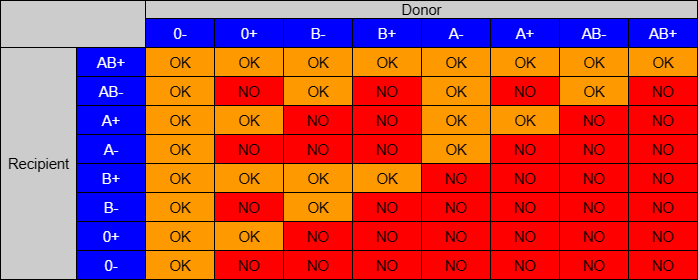
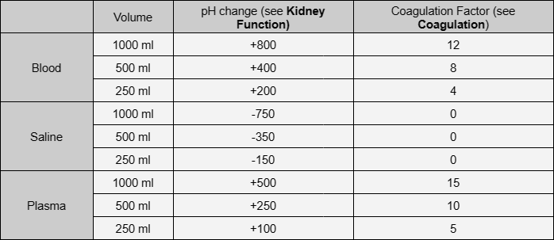
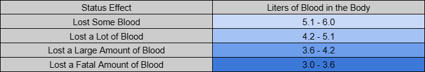

# Fluids

ของเหลวทั้งหมดที่มีในม็อดไม่มีวันหมดอายุ เลือดแบ่งออกเป็นกลุ่มและต้องบริหารตามรูปแบบด้านล่าง คุณสามารถดูแบบแผนได้จาก "เอกสารข้อมูลกรุ๊ปเลือด" ซึ่งสามารถพบได้ในคลังแสงและเปิดโดยใช้เมนู ACE อาการของการให้เลือดผิดคือ HR ลดลงอย่างมาก ควรรักษาด้วยยาแก้ปวด

    การจ่ายของเหลวจำเป็นต้องใช้เข็ม (หากเปิดใช้งานในการตั้งค่าเสริม):
    <ul>
        <li>16g IV - แขนขาไม่มีสายรัดเท่านั้น</li>
        <li>FAST IO - ลำตัวเท่านั้นทำให้เกิดความเจ็บปวด</li>
    </ul>

    16g IV อาจถูกขัดขวางโดยสุ่มในขณะที่ใช้งาน TXA หรือ EACA เมื่อของเหลวหยุดไหลผ่านเข็ม ให้ใช้การดำเนินการ "inspect catheter" เพื่อตรวจหาสิ่งกีดขวาง เพื่อกำจัดสิ่งกีดขวาง ให้ใช้การกระทำ "Saline Flush" Saline Flush ต้องใช้น้ำเกลืออย่างน้อย 30 มล. ที่ต้องฉีดระหว่างการดำเนินการ การถอด IV ออกระหว่างการให้สารน้ำทำให้ได้ของเหลวบางส่วนกลับคืนมา

